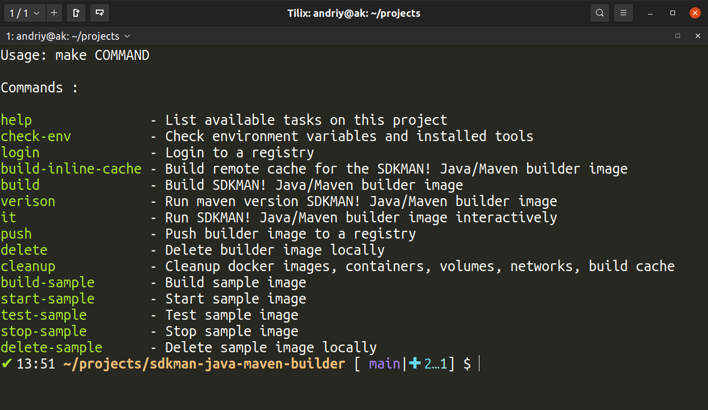

# SDKMan! Java/Maven Builder docker image

[](https://github.com/AndriyKalashnykov/sdkman-java-maven-builder/actions/workflows/main.yml)
[](https://hub.docker.com/r/andriykalashnykov/sdkman/)

Docker image with various Java and Maven versions to build Java Maven projects.

## Pre-Requisites

* Docker
* DockerHub login and password
    ```bash
    DOCKER_LOGIN= 
    DOCKER_PWD=
    ```

### Help

```bash
make help
```



### Login to the Docker Image registry

```bash
make login
```

### Build Docker Image with default JAVA_VERSION and MAVEN_VERSION

```bash
make build
```

### Build Docker Image with alternative JAVA_VERSION and MAVEN_VERSION and or different UID,GID,USER_NAME

```bash
make build JAVA_VERSION=16.0.1.hs-adpt MAVEN_VERSION=3.8.1 USER_UID=1000 USER_GID=1000 USER_NAME=user
```

### Run Docker Image Interactively

```bash
make it
```

### Run `maven -version` Docker Image

```bash
make version
```

### Push Docker to DockerHub

```bash
make push
```

### Delete Docker Image

```bash
make delete
```
